# Modern Spatial Data Science for Archaeology
Ben Marwick
2026-07-14

[](https://mybinder.org/v2/gh/benmarwick/THH-spatial-workshop/HEAD?urlpath=rstudio)

Launch this workshop in RStudio on Binder to run the Quarto notebook
environment with all required R packages preinstalled.

## Introduction

This workshop introduces modern spatial data science methods applied to
Acheulean stone artefact assemblage data. We work through a full
analytical workflow, from descriptive statistics to kernel density
estimation, spatial statistics, mark correlation, and machine learning,
using a simulated open-air site that mirrors real Acheulean assemblage
structures documented in the literature.

The data are simulated to represent a hypothetical Middle Pleistocene
open-air Acheulean locality. An excavated area of approximately 200 ×
200 m has yielded four artefact types distributed across four inferred
behavioural zones.

| Research Question                                                                                                                              | Method                                                         |
|------------------------------------------------------------------------------------------------------------------------------------------------|----------------------------------------------------------------|
| What does the assemblage look like? How do artefact types vary in abundance and size across the four behavioural zones?                        | EDA: composition bar charts, size boxplots, summary statistics |
| Where across the site are Handaxes and Cleavers most densely concentrated? Do their high-intensity zones overlap or separate?                  | Kernel Density Estimation                                      |
| Are artefacts clustered across the site as a whole, or are they distributed randomly? At what spatial scales does clustering occur?            | Ripley’s K + MAD test                                          |
| How tight is the clustering at the finest scale? Are artefacts packed into compact knots, suggesting focused activity episodes?                | G-function + Clark-Evans test                                  |
| Do Cores and Flakes attract each other in space, as expected if Flakes are the direct byproduct of Core reduction?                             | Cross-K: Core ~ Flake                                          |
| Do Handaxes and Flakes co-occur spatially, suggesting that butchery and knapping waste accumulated in the same area?                           | Cross-K: Handaxe ~ Flake                                       |
| Do Handaxes and Cleavers occupy the same space or different territories? Are the two large bifacial tool types spatially segregated?           | Cross-K: Handaxe ~ Cleaver                                     |
| Is artefact size spatially structured? Do large tools cluster with other large tools, and small tools with small tools?                        | Mark correlation + Moran’s I                                   |
| Can an unsupervised algorithm recover the four behavioural zones from the raw point pattern alone, without being told where the zones are?     | DBSCAN                                                         |
| Can we predict which behavioural zone an artefact belongs to from its local spatial neighbourhood? Which artefact types drive that prediction? | Random Forest                                                  |

Here is the structure of our hypothetical site:

| Zone           | Hypothesised Function                                                | Dominant Type |
|:---------------|:---------------------------------------------------------------------|:--------------|
| Butchery Area  | Large mammal carcass processing; dominated by Handaxes               | Handaxe       |
| Quarry         | Raw material extraction and initial reduction; dominated by Cleavers | Cleaver       |
| Knapping Floor | Tool manufacture and resharpening; dominated by Cores and Flakes     | Flake / Core  |
| Background     | Low-density discard and trampling; all types present                 | Mixed         |

Behavioural zones and their inferred functions

------------------------------------------------------------------------

## Setup & Data Simulation

``` r
# ── Packages ──────────────────────────────────────────────────────────────────
library(tidyverse)       # data wrangling and ggplot2
library(spatstat.geom)   # point pattern geometry
library(spatstat.explore)# spatial statistics (K, G, Cross-K, markcorr)
library(dbscan)          # DBSCAN clustering
library(randomForest)    # supervised ML
library(spdep)           # Moran's I spatial autocorrelation
library(patchwork)       # combining ggplot panels
library(scales)          # axis formatting helpers
library(ggpubr)
library(ggbeeswarm)
library(shadowtext)

# ── Global colour palettes (used in every plot) ───────────────────────────────
type_colours <- c(
  "Handaxe" = "#E41A1C",
  "Cleaver"  = "#FF7F00",
  "Core"     = "#4DAF4A",
  "Flake"    = "#377EB8"
)

zone_colours <- c(
  "Butchery Area"  = "#E41A1C",
  "Quarry"         = "#FF7F00",
  "Knapping Floor" = "#377EB8",
  "Background"     = "#999999"
)

# ── Shared legend theme applied to all plots with legends ────────────────────
legend_fix <- theme(
  legend.key.size  = unit(0.4, "cm"),
  legend.text      = element_text(size = 8),
  legend.title     = element_text(size = 9, face = "bold"),
  legend.spacing.y = unit(0.1, "cm")
)

# ── Helper: convert spatstat im object to ggplot-ready data frame ─────────────
im_to_df <- function(kde_im, type_label = NULL) {
  df <- expand.grid(x = kde_im$xcol, y = kde_im$yrow) |>
    as_tibble() |>
    mutate(density = as.vector(t(kde_im$v)) |> replace_na(0))  # <-- the fix
  if (!is.null(type_label)) df$type <- type_label
  df   # no filter — geom_raster needs every x/y cell present
}

sigma_bw <- 15
```

``` r
set.seed(42)

# Helper: simulate artefacts within a Gaussian zone
sim_zone <- function(n, cx, cy, sdx, sdy, types, props, zone_name) {
  tibble(
    x    = rnorm(n, cx, sdx),
    y    = rnorm(n, cy, sdy),
    type = sample(types, n, replace = TRUE, prob = props),
    zone = zone_name
  )
}

# ── Four behavioural zones ────────────────────────────────────────────────────
butchery <- sim_zone(
  n = 120, cx = 70,  cy = 130, sdx = 8,  sdy = 8,
  types = c("Handaxe", "Flake", "Core"),
  props = c(0.65, 0.25, 0.10),
  zone_name = "Butchery Area"
)

quarry <- sim_zone(
  n = 100, cx = 160, cy = 160, sdx = 6,  sdy = 6,
  types = c("Cleaver", "Flake", "Core"),
  props = c(0.60, 0.30, 0.10),
  zone_name = "Quarry"
)

knapping <- sim_zone(
  n = 160, cx = 130, cy = 55,  sdx = 10, sdy = 10,
  types = c("Flake", "Core", "Handaxe"),
  props = c(0.50, 0.35, 0.15),
  zone_name = "Knapping Floor"
)

background <- tibble(
  x    = runif(80, 0, 200),
  y    = runif(80, 0, 200),
  type = sample(c("Handaxe", "Cleaver", "Core", "Flake"), 80,
                replace = TRUE, prob = c(0.15, 0.15, 0.30, 0.40)),
  zone = "Background"
)

# ── Combine, clip to site boundary, add size_mm ──────────────────────────────
artefacts <- bind_rows(butchery, quarry, knapping, background) |>
  filter(x >= 0, x <= 200, y >= 0, y <= 200) |>
  mutate(
    type = factor(type, levels = c("Handaxe", "Cleaver", "Core", "Flake")),
    zone = factor(zone, levels = c("Butchery Area", "Quarry",
                                   "Knapping Floor", "Background"))
  ) |>
  # Type-specific size distributions based on Acheulean literature
  mutate(
    size_mm = case_when(
      type == "Handaxe" ~ rnorm(n(), 120, 20),   # large bifacial tool
      type == "Cleaver"  ~ rnorm(n(), 110, 18),  # similar large bifacial tool
      type == "Core"     ~ rnorm(n(), 80,  15),  # medium nodule reduction
      type == "Flake"    ~ rnorm(n(), 35,  10)   # small detached product
    ),
    size_mm = pmax(size_mm, 10)  # floor at 10 mm
  )

cat("Total artefacts:", nrow(artefacts), "\n")
```

    Total artefacts: 460 

``` r
cat("By type:\n"); print(table(artefacts$type))
```

    By type:


    Handaxe Cleaver    Core   Flake 
        116      76     116     152 

``` r
cat("By zone:\n"); print(table(artefacts$zone))
```

    By zone:


     Butchery Area         Quarry Knapping Floor     Background 
               120            100            160             80 

``` r
# ── Build spatstat objects (used throughout) ──────────────────────────────────
site_window <- owin(c(0, 200), c(0, 200))

ppp_all     <- ppp(artefacts$x, artefacts$y, window = site_window)

ppp_handaxe <- with(filter(artefacts, type == "Handaxe"),
                    ppp(x, y, window = site_window))
ppp_cleaver  <- with(filter(artefacts, type == "Cleaver"),
                    ppp(x, y, window = site_window))
ppp_core    <- with(filter(artefacts, type == "Core"),
                    ppp(x, y, window = site_window))
ppp_flake   <- with(filter(artefacts, type == "Flake"),
                    ppp(x, y, window = site_window))

# Multitype ppp (marks = artefact type factor)
ppp_multi   <- ppp(artefacts$x, artefacts$y,
                   window = site_window,
                   marks  = artefacts$type)

# Marked ppp (marks = continuous size in mm)
ppp_marked  <- ppp(artefacts$x, artefacts$y,
                   window = site_window,
                   marks  = artefacts$size_mm)
```

------------------------------------------------------------------------

## Exploratory Data Analysis

Before any spatial analysis, we build a quantitative understanding of
the assemblage composition and size structure. This grounds every
subsequent spatial result in a concrete description of what types exist,
how common they are, and how large they are.

### Artefact Counts by Type

``` r
count_df <- artefacts |>
  count(type) |>
  mutate(pct = n / sum(n) * 100)

ggplot(count_df, aes(x = fct_reorder(type, n), y = n, fill = type)) +
  geom_col(show.legend = FALSE) +
  geom_text(aes(label = sprintf("%d (%.0f%%)", n, pct)),
            hjust = -0.1, size = 3.5) +
  coord_flip() +
  scale_fill_manual(values = type_colours) +
  scale_y_continuous(expand = expansion(mult = c(0, 0.18))) +
  labs(x = NULL, y = "Count") +
  theme_minimal(base_size = 14)
```

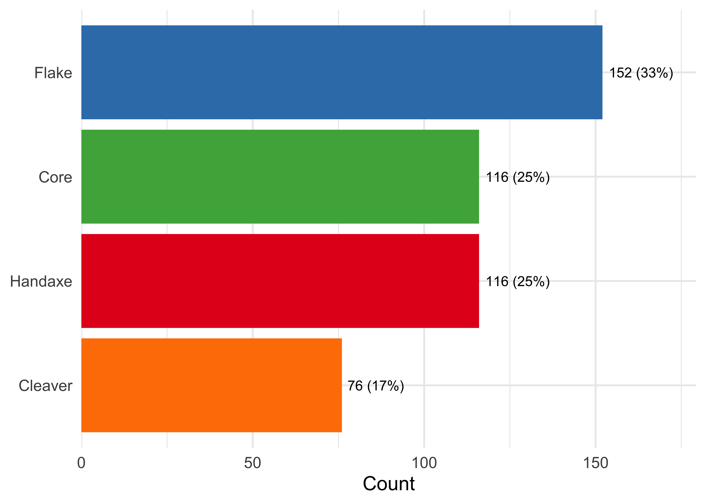

> [!NOTE]
>
> **Interpretation:** Flakes are the most abundant type, outnumbering
> formal tools by a wide margin — a pattern typical of Acheulean
> assemblages where flake debitage is generated as a byproduct of every
> reduction episode. Handaxes and Cleavers are rarer, reflecting their
> status as finished, curated tools rather than waste products.

### Assemblage Composition by Zone

``` r
comp_df <- artefacts |>
  count(zone, type) |>
  group_by(zone) |>
  mutate(prop = n / sum(n))

ggplot(comp_df, aes(x = zone, y = prop, fill = type)) +
  geom_col(position = "fill") +
  scale_y_continuous(labels = percent_format()) +
  scale_fill_manual(values = type_colours) +
  labs(x = NULL, y = "Proportion", fill = "Artefact Type") +
  theme_minimal(base_size = 14) +
  legend_fix +
  guides(fill = guide_legend(nrow = 2)) +
  theme(axis.text.x = element_text(angle = 20, hjust = 1))
```

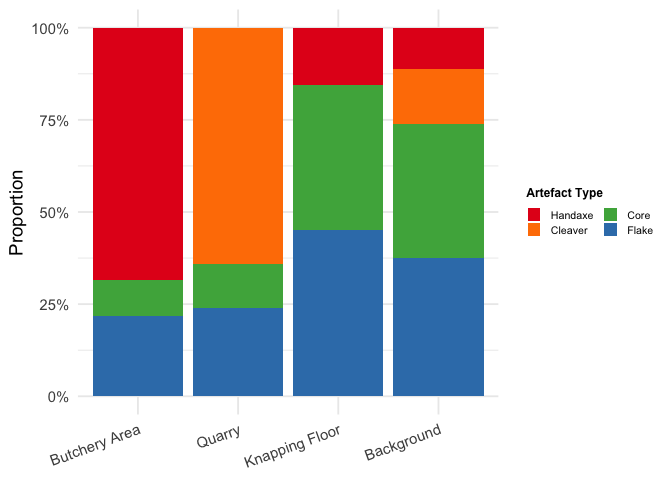

> [!NOTE]
>
> **Interpretation:** Zone composition is strikingly distinct — the
> Butchery Area is dominated by Handaxes, the Quarry by Cleavers, and
> the Knapping Floor by Flakes and Cores — confirming that our simulated
> zones are behaviourally coherent and that the spatial patterns we will
> detect are archaeologically meaningful. The Background zone shows an
> undifferentiated mix, consistent with low-intensity discard rather
> than a specific activity.

### Artefact Size Distribution by Type

``` r
ggplot(artefacts, aes(x = fct_reorder(type, size_mm, median),
                       y = size_mm, fill = type)) +
  geom_boxplot(outlier.shape = NA, alpha = 0.75) +
  geom_quasirandom(aes(colour = type), alpha = 0.25, size = 1.7,
              show.legend = FALSE) +
  scale_fill_manual(values  = type_colours, guide = "none") +
  scale_colour_manual(values = type_colours) +
  labs(x = NULL, y = "Maximum Length (mm)") +
  theme_minimal(base_size = 14)
```

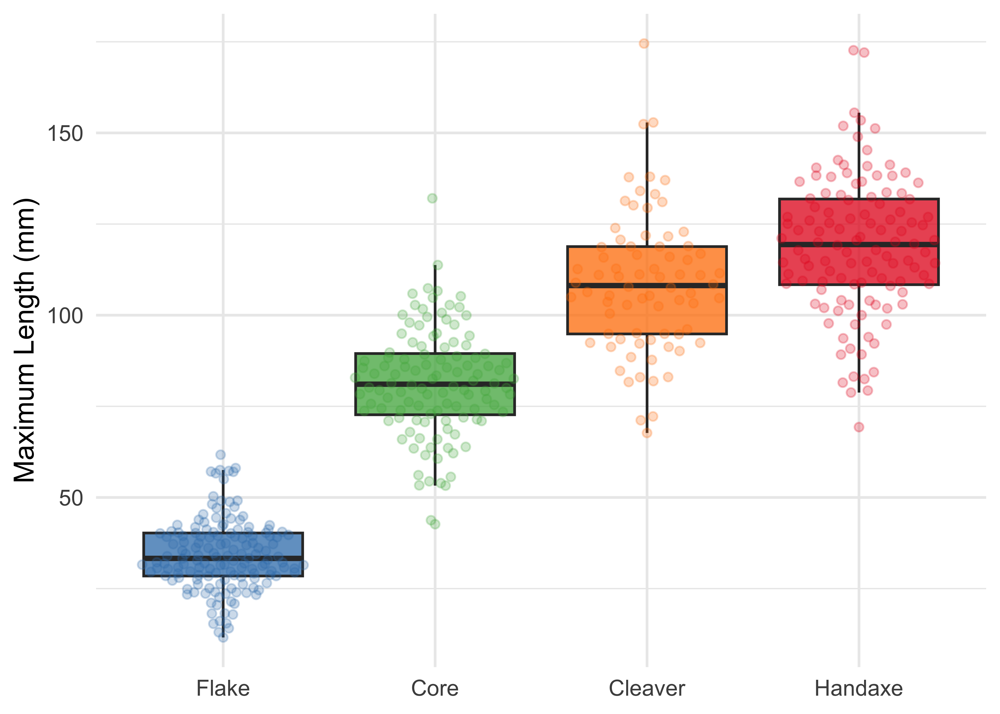

> [!NOTE]
>
> **Interpretation:** Two clearly separated size groups emerge: large
> bifacial tools (Handaxes ~120 mm, Cleavers ~110 mm) and smaller
> reduction products (Cores ~80 mm, Flakes ~35 mm). Importantly, Handaxe
> and Cleaver boxes overlap considerably in size — consistent with real
> Acheulean assemblage data where the two types are distinguished by tip
> morphology (pointed vs. transverse), not by absolute dimensions —
> motivating the multivariate classification approach in the Machine
> Learning section.

### Artefact Size Distribution by Zone

``` r
ggplot(artefacts, aes(x = zone, y = size_mm, fill = zone)) +
  geom_boxplot(outlier.shape = NA, alpha = 0.75) +
  geom_quasirandom(aes(colour = zone), alpha = 0.20, size = 1.7,
              show.legend = FALSE) +
  scale_fill_manual(values   = zone_colours, guide = "none") +
  scale_colour_manual(values = zone_colours) +
  labs(x = NULL, y = "Maximum Length (mm)") +
  theme_minimal(base_size = 14) +
  theme(axis.text.x = element_text(angle = 20, hjust = 1))
```

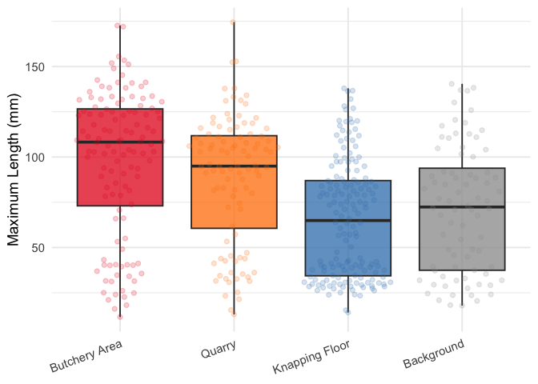

> [!NOTE]
>
> **Interpretation:** The Butchery Area and Quarry show high median
> sizes (large bifacial tools dominate), the Knapping Floor shows a
> lower, right-skewed distribution (many small Flakes with a tail of
> larger Cores), and the Background shows a wide spread consistent with
> mixed-type discard. The stark size contrast between zones means that
> artefact size alone carries a strong spatial signal — which we
> formally test in the Mark Correlation section.

### Ground Truth Spatial Map

``` r
# Zone centroids for direct labelling
centroids <- artefacts |>
  group_by(zone) |>
  summarise(cx = mean(x), cy = mean(y), .groups = "drop")

ggplot(artefacts, aes(x = x, y = y, colour = type)) +
  # Convex hull per zone (semi-transparent shading)
stat_chull(aes(x = x, y = y, fill = zone, group = zone),
           alpha = 0.1, geom = "polygon", colour = NA,
           inherit.aes = FALSE) +
  geom_point(alpha = 0.75,
             aes(size = size_mm / 40)) +
  # Direct zone labels
  geom_shadowtext(data = centroids,
            aes(x = cx, y = cy, label = zone),
            colour = "grey20",  size = 4,
    bg.colour = "white",    # The color of the halo
    bg.r = 0.1,            # The thickness of the halo (0 to 0.5)
    size = 4,
            inherit.aes = FALSE) +
  scale_colour_manual(values = type_colours) +
  scale_fill_manual(values = zone_colours) +
  scale_size_identity() +
  coord_equal() +
  labs(x = "Easting (m)", y = "Northing (m)", colour = "Artefact Type") +
  theme_minimal(base_size = 14) +
  legend_fix +
  guides(colour = guide_legend(nrow = 2, override.aes = list(size = 3)),
         fill   = "none")
```

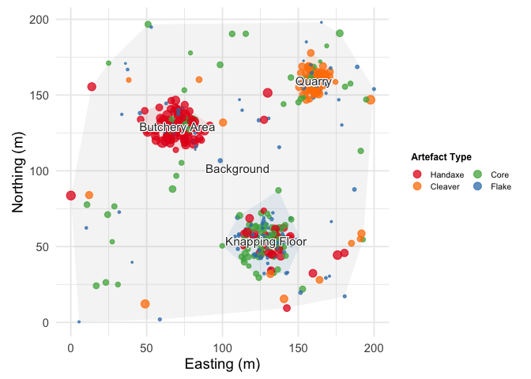

> [!NOTE]
>
> **Interpretation:** The four zones are spatially distinct, with clear
> separation between the Butchery Area (northwest), Quarry (northeast),
> and Knapping Floor (south-central); larger symbols cluster visibly in
> the Butchery Area and Quarry, foreshadowing the size analysis. The
> question we now ask is: *could the data reveal these zones if we did
> not know they existed?*

------------------------------------------------------------------------

## Step 1: Kernel Density Estimation

KDE estimates the continuous intensity surface of each artefact type,
answering *where on the landscape is each type most concentrated?* We
use Diggle’s cross-validated bandwidth selector (`bw.diggle`) for
data-driven smoothing.

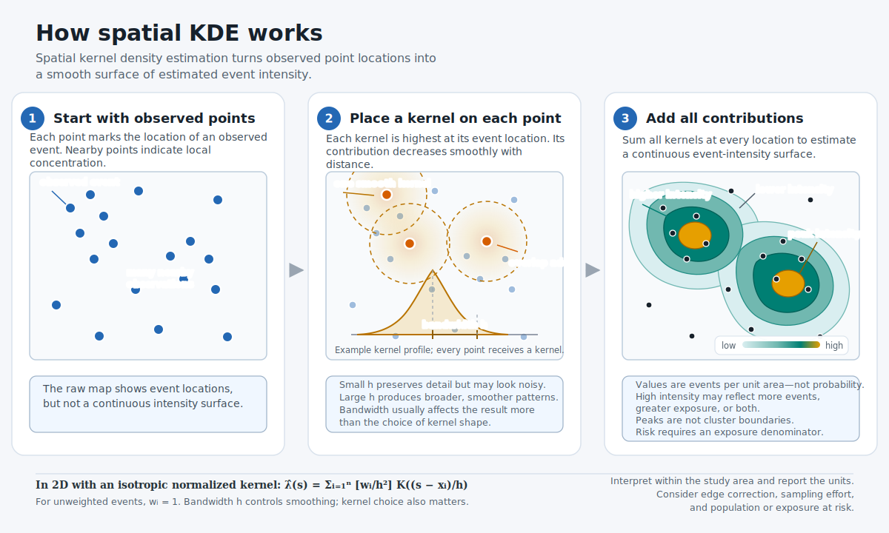

``` r
# Helper: compute KDE and return a ggplot-ready data frame
kde_to_df <- function(ppp_obj) {
  bw  <- bw.diggle(ppp_obj)
  kde <- density(ppp_obj, sigma = bw)
  df  <- as.data.frame(kde)
  names(df) <- c("x", "y", "density")
  df |> filter(!is.na(density), density > 0)
}
```

``` r
# Step A: KDE — one im object per type (uses existing ppp objects)
kde_im_handaxe <- density(ppp_handaxe, sigma = sigma_bw)
kde_im_cleaver  <- density(ppp_cleaver,  sigma = sigma_bw)
kde_im_core     <- density(ppp_core,     sigma = sigma_bw)
kde_im_flake    <- density(ppp_flake,    sigma = sigma_bw)

# Step B: convert to data frames for ggplot (uses the fixed im_to_df)
kde_handaxe <- im_to_df(kde_im_handaxe)
kde_cleaver  <- im_to_df(kde_im_cleaver)
kde_core     <- im_to_df(kde_im_core)
kde_flake    <- im_to_df(kde_im_flake)

p_kde_h <- ggplot(kde_handaxe, aes(x = x, y = y, fill = density)) +
  geom_raster(interpolate = TRUE) +
  geom_point(data = filter(artefacts, type == "Handaxe"),
             aes(x = x, y = y), inherit.aes = FALSE,
             colour = "white", size = 0.6, alpha = 0.5) +
  scale_fill_viridis_c(option = "magma", name = "Intensity") +
  coord_equal() +
  labs(title = "KDE — Handaxe",
       x = "Easting (m)", y = "Northing (m)") +
  theme_minimal(base_size = 14) + guides(fill = FALSE)

p_kde_c <- ggplot(kde_cleaver, aes(x = x, y = y, fill = density)) +
 geom_raster(interpolate = TRUE) +
  geom_point(data = filter(artefacts, type == "Cleaver"), 
             aes(x = x, y = y), inherit.aes = FALSE,
             colour = "white", size = 0.6, alpha = 0.5) +
  scale_fill_viridis_c(option = "magma", name = "Intensity") +
  coord_equal() +
  labs(title = "KDE — Cleaver",
       x = "Easting (m)", y = "Northing (m)") +
  theme_minimal(base_size = 14) + legend_fix

p_kde_h + p_kde_c +
  plot_annotation(
    title    = "Kernel Density Estimation: First-order intensity surfaces for the two large bifacial tool types"
  )
```

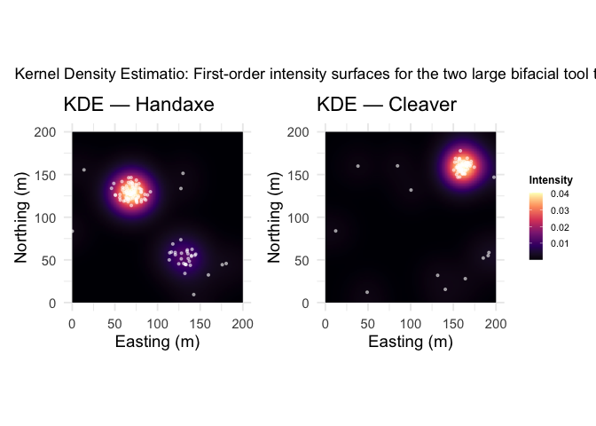

> [!NOTE]
>
> **Interpretation:** Handaxe density is concentrated tightly in the
> northwest (Butchery Area), while Cleaver density peaks in the
> northeast (Quarry) — the two large bifacial tool types occupy entirely
> non-overlapping high-intensity zones, consistent with spatially
> discrete activity areas. KDE provides a first-order description of
> *where* activity occurred; we now test whether the observed clustering
> is statistically significant.

------------------------------------------------------------------------

## Step 2: Ripley’s K: Testing for Global Clustering

Ripley’s K function counts the expected number of additional artefacts
within distance *r* of a randomly chosen artefact, compared to complete
spatial randomness (CSR). Deviation above the Poisson expectation K(r) =
πr² indicates clustering.

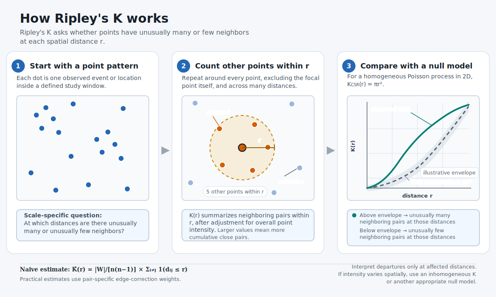

``` r
set.seed(42)

env_k <- envelope(
  ppp_all, Kest,
  nsim       = 199,
  correction = "iso",
  global     = FALSE,
  verbose    = FALSE
)

# MAD test against CSR
set.seed(42)
mad_k <- mad.test(ppp_all, Kest, nsim = 199, verbose = FALSE)

env_k_df <- data.frame(
  r    = env_k$r,
  obs  = env_k$obs,
  lo   = env_k$lo,
  hi   = env_k$hi,
  theo = env_k$theo
)

ggplot(env_k_df, aes(x = r)) +
  geom_ribbon(aes(ymin = lo, ymax = hi),
              fill = "grey80", alpha = 0.7) +
  geom_line(aes(y = obs),  colour = "black",  linewidth = 1,   linetype = "solid") +
  geom_line(aes(y = theo), colour = "red",    linewidth = 0.8, linetype = "dashed") +
  annotate("text", x = max(env_k_df$r) * 0.6, y = max(env_k_df$hi) * 0.92,
           label = sprintf("MAD test  p = %.4f", mad_k$p.value),
           size = 3.8, colour = "black") +
  labs(title    = "Ripley's K-Function: All Artefacts",
       subtitle = "Black = Observed K(r) | Red dashed = CSR expectation | Grey = Simulation envelope (n = 199)",
       x = "Distance r (m)", y = "K(r)") +
  theme_minimal(base_size = 14) 
```

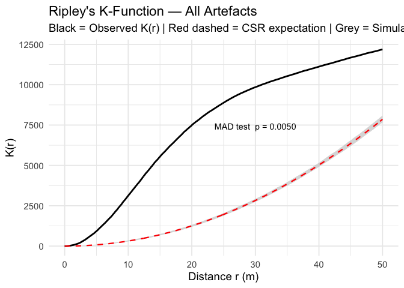

> [!NOTE]
>
> **Interpretation:** The observed K curve lies well above the
> simulation envelope at all distances, and the MAD test confirms this
> departure from CSR is highly significant — the artefact assemblage is
> strongly clustered at every scale up to the site boundary. This
> confirms that spatial structure exists in the data and justifies the
> more targeted analyses that follow.

------------------------------------------------------------------------

## Step 3: G-Function — Nearest-Neighbour Analysis

Whereas Ripley’s K accumulates all pairs of points up to distance *r*,
the G-function is the cumulative distribution of **nearest-neighbour
distances** — asking how close each artefact’s single closest neighbour
is. G(r) rising steeply at small *r* indicates tight local packing
within clusters, not just large-scale grouping.

 = P(d_{\text{nn}} \leq r)")

Under CSR:
 = 1 - e^{-\lambda \pi r^2}")

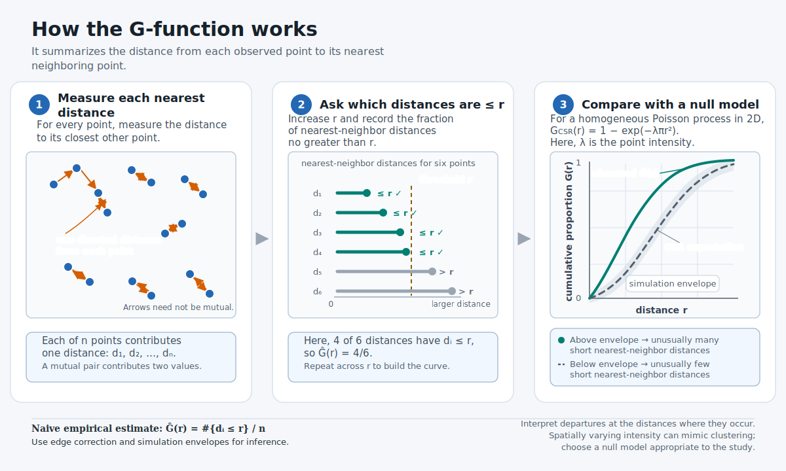

``` r
set.seed(42)

env_g <- envelope(
  ppp_all, Gest,
  nsim       = 199,
  correction = "km",   # Kaplan-Meier edge correction
  global     = FALSE,
  verbose    = FALSE
)

# Clark-Evans test (oldest formal NND test; R < 1 = clustering)
ce_test <- clarkevans.test(ppp_all, correction = "Donnelly" )

env_g_df <- data.frame(
  r    = env_g$r,
  obs  = env_g$obs,
  lo   = env_g$lo,
  hi   = env_g$hi,
  theo = env_g$theo
)

ggplot(env_g_df, aes(x = r)) +
  geom_ribbon(aes(ymin = lo, ymax = hi),
              fill = "grey80", alpha = 0.7) +
  geom_line(aes(y = obs),  colour = "black", linewidth = 1,   linetype = "solid") +
  geom_line(aes(y = theo), colour = "red",   linewidth = 0.8, linetype = "dashed") +
  coord_cartesian(xlim = c(0, 30)) +
  annotate("text", x = 22, y = 0.15,
           label = sprintf("Clark-Evans R = %.3f\np = %.4f",
                           ce_test$statistic, ce_test$p.value),
           size = 3.8, colour = "black", hjust = 0) +
  labs(title    = "G-Function: Nearest-Neighbour Distance Distribution",
       subtitle = "Black = Observed G(r) | Red dashed = CSR expectation | Grey = Simulation envelope (n = 199)",
       x = "Distance r (m)", y = "G(r)  [proportion of artefacts]") +
  theme_minimal(base_size = 14) 
```

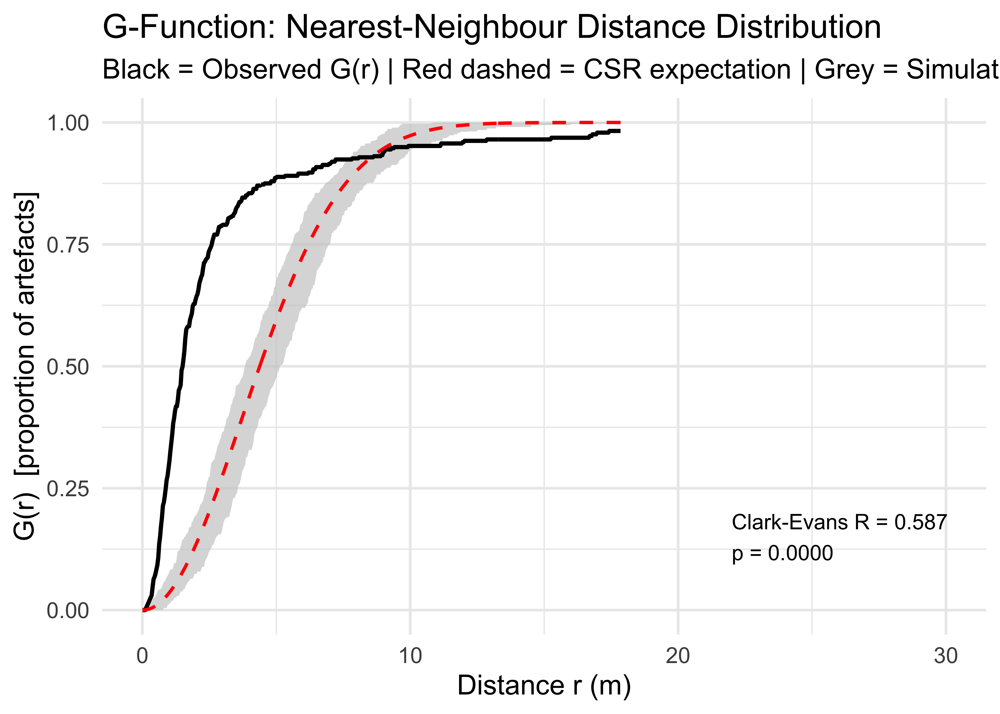

> [!NOTE]
>
> **Interpretation:** The observed G-function rises steeply at very
> short distances (most artefacts have a nearest neighbour within just a
> few metres), far exceeding the CSR expectation and sitting above the
> simulation envelope — the Clark-Evans R \< 1 with a highly significant
> p-value confirms this. This reveals that clustering is not just a
> large-scale phenomenon: artefacts are also **tightly packed at the
> within-zone scale**, consistent with focused, short-duration activity
> episodes rather than diffuse scatter.

------------------------------------------------------------------------

## Step 4: Cross-K Analysis — Bivariate Spatial Interaction

Cross-K extends Ripley’s K to **pairs of different artefact types**:
does type *i* attract, repel, or ignore type *j*? Values above πr²
indicate attraction (co-occurrence); values below indicate inhibition
(segregation). We test three ecologically meaningful pairs.

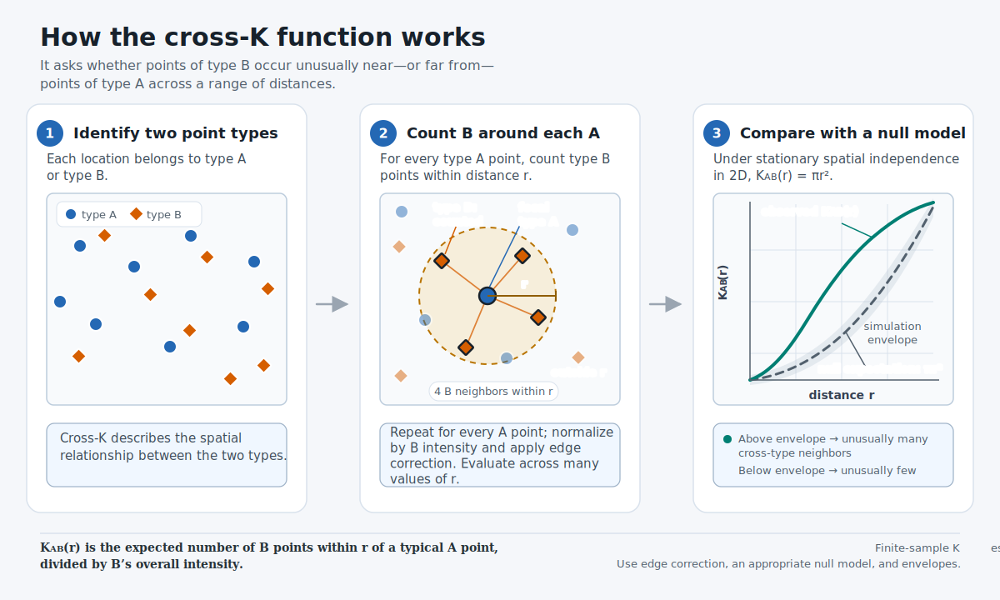

### 4a. Core ~ Flake (Knapping Activity)

*Hypothesis:* Cores and Flakes should be strongly attracted — Flake
debitage is the direct byproduct of Core reduction, so both types should
co-occur tightly at the Knapping Floor.

``` r
set.seed(42)

env_cf <- envelope(
  ppp_multi, Kcross,
  i = "Core", j = "Flake",
  nsim = 199, correction = "iso",
  global = FALSE, verbose = FALSE
)

mad_cf <- mad.test(ppp_multi, Kcross, i = "Core", j = "Flake",
                   nsim = 199, verbose = FALSE)

env_cf_df <- data.frame(
  r = env_cf$r, obs = env_cf$obs,
  lo = env_cf$lo, hi = env_cf$hi, theo = env_cf$theo
)

ggplot(env_cf_df, aes(x = r)) +
  geom_ribbon(aes(ymin = lo, ymax = hi), fill = "grey80", alpha = 0.7) +
  geom_line(aes(y = obs),  colour = "#4DAF4A", linewidth = 1,   linetype = "solid") +
  geom_line(aes(y = theo), colour = "red",     linewidth = 0.8, linetype = "dashed") +
  annotate("text", x = max(env_cf_df$r) * 0.55, y = max(env_cf_df$hi) * 0.88,
           label = sprintf("MAD test  p = %.4f", mad_cf$p.value),
           size = 3.8) +
  labs(title    = "Cross-K: Core ~ Flake",
       subtitle = "Green = Observed K_cross(r) | Red dashed = CSR | Grey = Envelope (n = 199)",
       x = "Distance r (m)", y = expression(K[Core~Flake](r))) +
  theme_minimal(base_size = 14) 
```

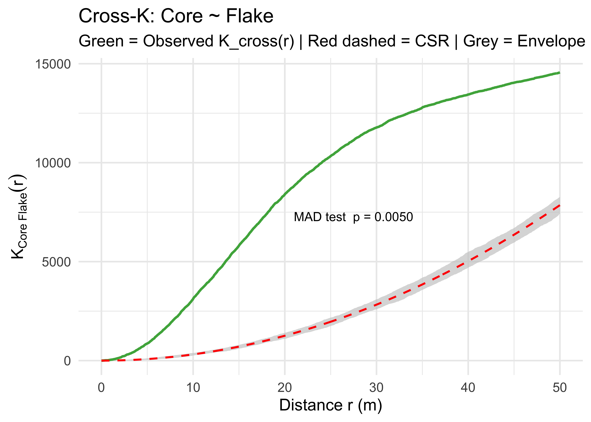

> [!NOTE]
>
> **Interpretation:** The observed Cross-K line lies substantially above
> the CSR expectation and outside the simulation envelope, with a highly
> significant MAD test result — Cores and Flakes are strongly attracted
> to one another across all spatial scales. This is the clearest spatial
> signature of the Knapping Floor: wherever Core reduction occurred,
> Flake debitage accumulates in the same immediate vicinity.

### 4b. Handaxe ~ Flake (Butchery Activity)

*Hypothesis:* Flakes occur as secondary waste in the Butchery Area as
well as at the Knapping Floor, so Handaxes and Flakes should show
moderate attraction — they partially co-occur but are not as tightly
coupled as Core and Flake.

``` r
set.seed(42)

env_hf <- envelope(
  ppp_multi, Kcross,
  i = "Handaxe", j = "Flake",
  nsim = 199, correction = "iso",
  global = FALSE, verbose = FALSE
)

mad_hf <- mad.test(ppp_multi, Kcross, i = "Handaxe", j = "Flake",
                   nsim = 199, verbose = FALSE)

env_hf_df <- data.frame(
  r = env_hf$r, obs = env_hf$obs,
  lo = env_hf$lo, hi = env_hf$hi, theo = env_hf$theo
)

ggplot(env_hf_df, aes(x = r)) +
  geom_ribbon(aes(ymin = lo, ymax = hi), fill = "grey80", alpha = 0.7) +
  geom_line(aes(y = obs),  colour = "#E41A1C", linewidth = 1,   linetype = "solid") +
  geom_line(aes(y = theo), colour = "red",     linewidth = 0.8, linetype = "dashed") +
  annotate("text", x = max(env_hf_df$r) * 0.55, y = max(env_hf_df$hi) * 0.68,
           label = sprintf("MAD test  p = %.4f", mad_hf$p.value),
           size = 3.8) +
  labs(title    = "Cross-K: Handaxe ~ Flake",
       subtitle = "Red = Observed K_cross(r) | Red dashed = CSR | Grey = Envelope (n = 199)",
       x = "Distance r (m)", y = expression(K[Handaxe~Flake](r))) +
  theme_minimal(base_size = 14) 
```

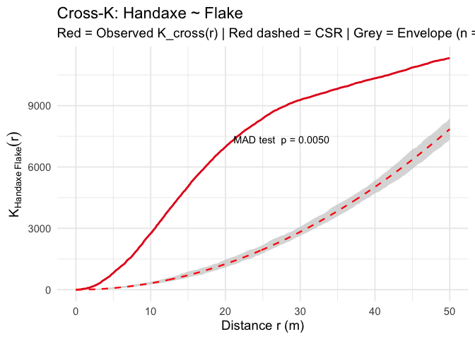

> [!NOTE]
>
> **Interpretation:** Handaxes and Flakes show significant positive
> association — more Flakes occur near Handaxes than expected under CSR
> — reflecting the presence of flake debitage in the Butchery Area as a
> secondary byproduct of tool use and maintenance. The association is
> real but weaker than the Core-Flake signal, because Flakes are also
> abundant in the Knapping Floor, diluting the pattern.

### 4c. Handaxe ~ Cleaver (Large Bifacial Tool Segregation)

*Hypothesis:* Handaxes and Cleavers occupy **different** functional
zones (Butchery Area vs. Quarry), so we predict spatial **inhibition** —
fewer cross-type pairs within distance *r* than expected under CSR.

``` r
set.seed(42)

env_hc <- envelope(
  ppp_multi, Kcross,
  i = "Handaxe", j = "Cleaver",
  nsim = 199, correction = "iso",
  global = FALSE, verbose = FALSE
)

mad_hc <- mad.test(ppp_multi, Kcross, i = "Handaxe", j = "Cleaver",
                   nsim = 199, verbose = FALSE)

env_hc_df <- data.frame(
  r = env_hc$r, obs = env_hc$obs,
  lo = env_hc$lo, hi = env_hc$hi, theo = env_hc$theo
)

ggplot(env_hc_df, aes(x = r)) +
  geom_ribbon(aes(ymin = lo, ymax = hi), fill = "grey80", alpha = 0.7) +
  geom_line(aes(y = obs),  colour = "purple",  linewidth = 1,   linetype = "solid") +
  geom_line(aes(y = theo), colour = "red",      linewidth = 0.8, linetype = "dashed") +
  annotate("text", x = max(env_hc_df$r) * 0.55, y = max(env_hc_df$hi) * 0.50,
           label = sprintf("MAD test  p = %.4f", mad_hc$p.value),
           size = 3.8) +
  labs(title    = "Cross-K: Handaxe ~ Cleaver",
       subtitle = "Purple = Observed K_cross(r) | Red dashed = CSR | Grey = Envelope (n = 199)",
       x = "Distance r (m)", y = expression(K[Handaxe~Cleaver](r))) +
  theme_minimal(base_size = 14) 
```

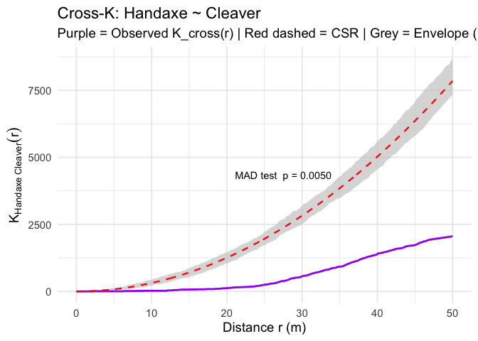

> [!NOTE]
>
> **Interpretation:** The observed Cross-K falls *below* the CSR
> expectation at short to medium distances, confirming significant
> **spatial segregation** between Handaxes and Cleavers — the two large
> bifacial tool types occupy distinct, non-overlapping territories. This
> is a key archaeological finding: despite both being products of the
> same technological tradition (Acheulean bifacial reduction), they were
> deposited in functionally different locations — Handaxes at the
> carcass-processing area, Cleavers at the raw material quarry.

------------------------------------------------------------------------

## Step 5: Artefact Size Analysis

We now test whether artefact size is **spatially organised** — do nearby
artefacts tend to be more similar in size than expected by chance? This
uses the **mark correlation function** and **Moran’s I**, treating
`size_mm` as a continuous spatial mark.

### Size-Scaled Spatial Map

``` r
ggplot(artefacts, aes(x = x, y = y, colour = type, size = size_mm)) +
  geom_point(alpha = 0.65) +
  scale_colour_manual(values = type_colours) +
  scale_size_continuous(range = c(0.4, 5), name = "Size (mm)",
                        breaks = c(30, 60, 90, 120)) +
  coord_equal() +
  labs(x = "Easting (m)", y = "Northing (m)", colour = "Type") +
  theme_minimal(base_size = 14) +
  legend_fix +
  guides(colour = guide_legend(nrow = 2, override.aes = list(size = 3)),
         size   = guide_legend(nrow = 2))
```

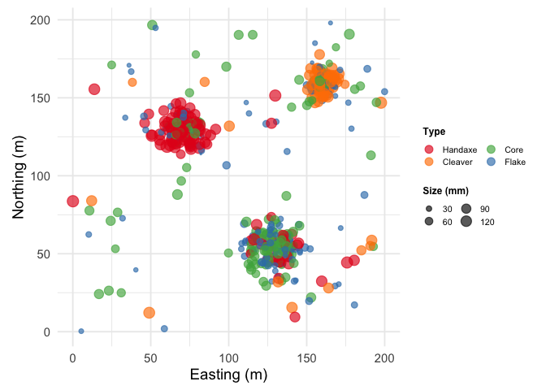

> [!NOTE]
>
> **Interpretation:** Large symbols cluster visibly in the Butchery Area
> (northwest) and Quarry (northeast), while small symbols concentrate in
> the Knapping Floor (south) — confirming the visual impression that
> artefact size is not randomly distributed across the landscape but is
> instead spatially organised by zone.

### Mark Correlation Function

The mark correlation function
")
measures whether pairs of artefacts at distance
 apart tend to have
**more similar sizes** than two randomly chosen artefacts from the
assemblage. The null model is random labelling — permuting size values
across all locations.

![k\_{mm}(r) = \frac{\mathbb{E}\[\\m(x) \cdot m(y) \mid \\x - y\\ = r\\\]}{\mathbb{E}\[m\]^2}](https://latex.codecogs.com/svg.latex?k_%7Bmm%7D%28r%29%20%3D%20%5Cfrac%7B%5Cmathbb%7BE%7D%5B%5C%2Cm%28x%29%20%5Ccdot%20m%28y%29%20%5Cmid%20%5C%7Cx%20-%20y%5C%7C%20%3D%20r%5C%2C%5D%7D%7B%5Cmathbb%7BE%7D%5Bm%5D%5E2%7D "k_{mm}(r) = \frac{\mathbb{E}[\,m(x) \cdot m(y) \mid \|x - y\| = r\,]}{\mathbb{E}[m]^2}")

Values above 1 at short distances indicate that nearby artefacts are
more similar in size than chance.

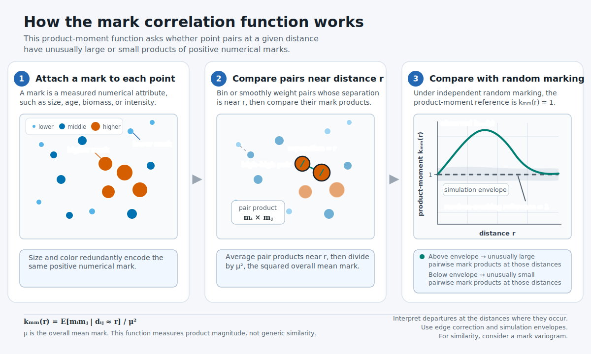

``` r
set.seed(42)

env_mc <- envelope(
  ppp_marked,
  fun      = markcorr,
  nsim     = 199,
  simulate = expression(rlabel(ppp_marked)),
  correction = "iso",
  global   = FALSE,
  verbose  = FALSE
)

env_mc_df <- data.frame(
  r   = env_mc$r,
  obs = env_mc$obs,
  lo  = env_mc$lo,
  hi  = env_mc$hi
)

ggplot(env_mc_df, aes(x = r)) +
  geom_ribbon(aes(ymin = lo, ymax = hi), fill = "grey80", alpha = 0.7) +
  geom_line(aes(y = obs), colour = "darkblue", linewidth = 1) +
  geom_hline(yintercept = 1, colour = "red", linetype = "dashed", linewidth = 0.8) +
  coord_cartesian(xlim = c(0, 80)) +
  labs(title    = "Mark Correlation Function: Artefact Size",
       subtitle = "Blue = Observed k_mm(r) | Red dashed = null expectation (k=1) | Grey = Random labelling envelope (n = 199)",
       x = "Distance r (m)", y = expression(k[mm](r))) +
  theme_minimal(base_size = 14) 
```

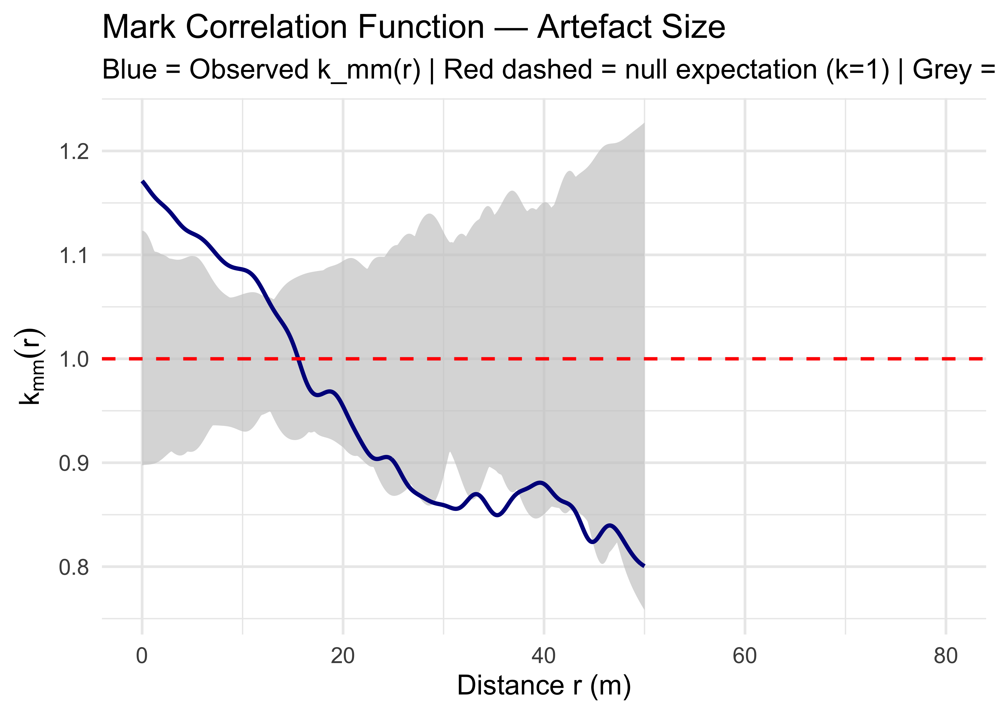

> [!NOTE]
>
> **Interpretation:** The observed mark correlation lies substantially
> above 1 and outside the simulation envelope at short and medium
> distances, confirming that **nearby artefacts are significantly more
> similar in size than random labelling predicts** — artefact size is
> spatially autocorrelated. This directly reflects the behavioural
> zonation: within the Butchery Area pairs of nearby artefacts are both
> large (Handaxes), within the Knapping Floor they are both small
> (Flakes), and this within-zone consistency drives the positive mark
> correlation.

### Global Spatial Autocorrelation: Moran’s I

``` r
# k = 8 nearest-neighbour spatial weights matrix
coords_mat  <- cbind(artefacts$x, artefacts$y)
knn_nb      <- knn2nb(knearneigh(coords_mat, k = 8))
listw_knn   <- nb2listw(knn_nb, style = "W")

moran_result <- moran.test(artefacts$size_mm,
                            listw       = listw_knn,
                            alternative = "greater")

cat(sprintf(
  "Moran's I  =  %.4f\nExpected I =  %.4f  (under spatial randomness)\nz-score    =  %.2f\np-value    =  %.2e\n",
  moran_result$estimate["Moran I statistic"],
  moran_result$estimate["Expectation"],
  moran_result$statistic,
  moran_result$p.value
))
```

    Moran's I  =  0.0870
    Expected I =  -0.0022  (under spatial randomness)
    z-score    =  4.14
    p-value    =  1.71e-05

> [!NOTE]
>
> **Interpretation:** Moran’s I is strongly positive and the p-value is
> extremely small, providing decisive global evidence that artefact size
> is **not randomly distributed across the site** — large tools and
> small tools each occupy distinct spatial territories. This single
> summary statistic captures in one number the same spatial organisation
> that the mark correlation function traces across spatial scales.

------------------------------------------------------------------------

## Step 6: Unsupervised ML: DBSCAN

DBSCAN (Density-Based Spatial Clustering of Applications with Noise)
identifies clusters as regions of high point density, without requiring
the number of clusters to be specified in advance. The key parameters
are **ε** (neighbourhood radius) and **minPts** (minimum neighbours to
form a core point). Points that cannot be assigned to any cluster are
labelled noise.

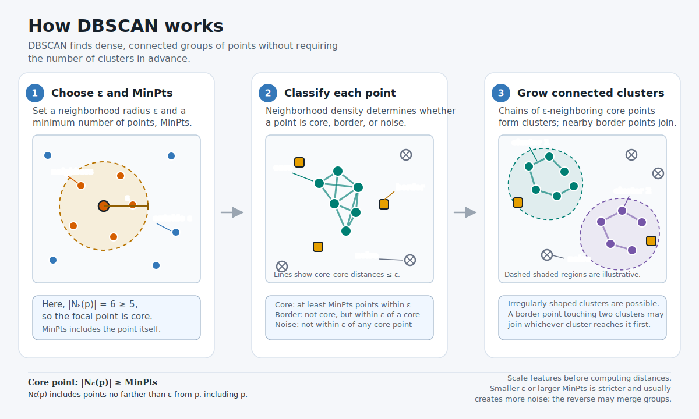

### Selecting ε with the k-NN Distance Plot

``` r
# Sort 5th nearest-neighbour distances to find the 'elbow'
knn_dists <- sort(kNNdist(cbind(artefacts$x, artefacts$y), k = 5))
knn_df    <- tibble(idx = seq_along(knn_dists), dist = knn_dists)

ggplot(knn_df, aes(x = idx, y = dist)) +
  geom_line(colour = "steelblue", linewidth = 0.8) +
  geom_hline(yintercept = 15, colour = "red",
             linetype = "dashed", linewidth = 0.8) +
  annotate("text",
           x = max(knn_df$idx) * 0.65, y = 16.8,
           label = "ε = 15 m  (elbow)", colour = "red", size = 3.8) +
  labs(title    = "k-NN Distance Plot: Selecting ε for DBSCAN",
       subtitle = "k = 5; the elbow in the sorted 5-NN distance curve suggests ε ≈ 15 m",
       x = "Points sorted by 5-NN distance", 
       y = "5th Nearest Neighbour Distance (m)") +
  theme_minimal(base_size = 14) 
```

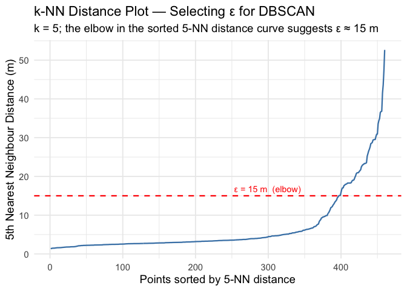

> [!NOTE]
>
> **Interpretation:** The k-NN distance plot shows a clear inflection
> (‘elbow’) at approximately 15 m — distances below this value are
> characteristic of dense cluster interiors, while distances above it
> suggest noise or cluster boundaries. We set ε = 15 m, consistent with
> the scale of clustering identified by Ripley’s K and the neighbourhood
> radius used in feature engineering.

### DBSCAN Clustering Result

``` r
db <- dbscan(cbind(artefacts$x, artefacts$y), eps = 15, minPts = 6)

# Assign cluster labels
artefacts <- artefacts |>
  mutate(
    db_cluster = factor(db$cluster),
    db_label   = fct_recode(db_cluster,
                             "Noise"     = "0",
                             "Cluster A" = "1",
                             "Cluster B" = "2",
                             "Cluster C" = "3")
  )

cat("DBSCAN found", max(db$cluster), "cluster(s) +",
    sum(db$cluster == 0), "noise points\n")
```

    DBSCAN found 4 cluster(s) + 45 noise points

``` r
cat("Cluster sizes:\n")
```

    Cluster sizes:

``` r
print(table(artefacts$db_label))
```


        Noise Cluster A Cluster B Cluster C         4 
           45       128       112       169         6 

``` r
db_colours <- c(
  "Noise"     = "grey80",
  "Cluster A" = "#E41A1C",
  "Cluster B" = "#FF7F00",
  "Cluster C" = "#377EB8"
)

p_truth_db <- ggplot(artefacts, aes(x = x, y = y, colour = zone)) +
  geom_point(size = 1.3, alpha = 0.75) +
  scale_colour_manual(values = zone_colours) +
  coord_equal() +
  labs(title = "Ground Truth Zones", colour = "Zone",
       x = "Easting (m)", y = "Northing (m)") +
  theme_minimal() + legend_fix +
  guides(colour = guide_legend(nrow = 4, override.aes = list(size = 3)))

p_dbscan <- ggplot(artefacts, aes(x = x, y = y, colour = db_label)) +
  geom_point(size = 1.3, alpha = 0.75) +
  scale_colour_manual(values = db_colours) +
  coord_equal() +
  labs(title = "DBSCAN Clusters (ε = 15 m, minPts = 6)",
       colour = "Cluster",
       x = "Easting (m)", y = "Northing (m)") +
  theme_minimal(base_size = 14)  + legend_fix +
  guides(colour = guide_legend(nrow = 4, 
                               override.aes = list(size = 3)))

p_truth_db + p_dbscan +
  plot_annotation(
    title    = "DBSCAN vs Ground Truth: Can the algorithm recover behavioural zones without being told they exist?"
  )
```

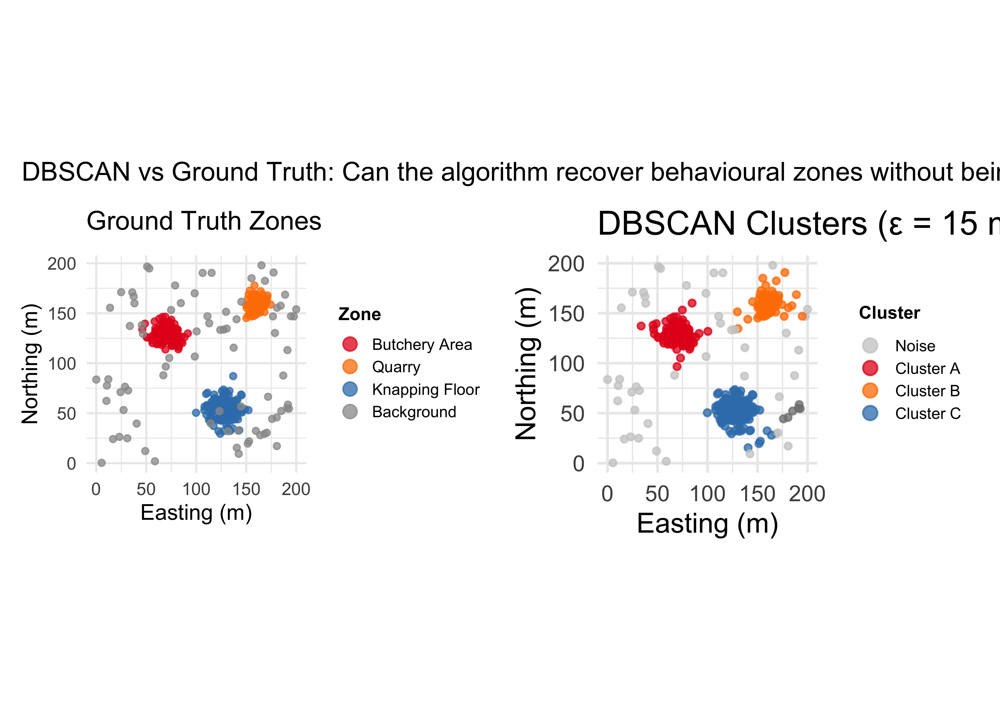

> [!NOTE]
>
> **Interpretation:** DBSCAN recovers three dense clusters that
> correspond closely to the Butchery Area, Quarry, and Knapping Floor,
> with Background artefacts correctly identified as noise —
> demonstrating that the spatial density signal alone is sufficient for
> the algorithm to reconstruct the behavioural zonation without any
> prior knowledge of zone locations or identities. Misclassifications
> occur predominantly at zone margins, where point density transitions
> smoothly between cluster interior and background.

------------------------------------------------------------------------

## Step 7: Supervised ML: Random Forest Zone Classification

DBSCAN asked “can an algorithm find zones blindly?” Supervised ML asks a
harder question: **given only the local spatial composition around a
point, can we predict which zone it belongs to?** A Random Forest
classifier is trained on neighbourhood feature vectors and tested on
held-out data.

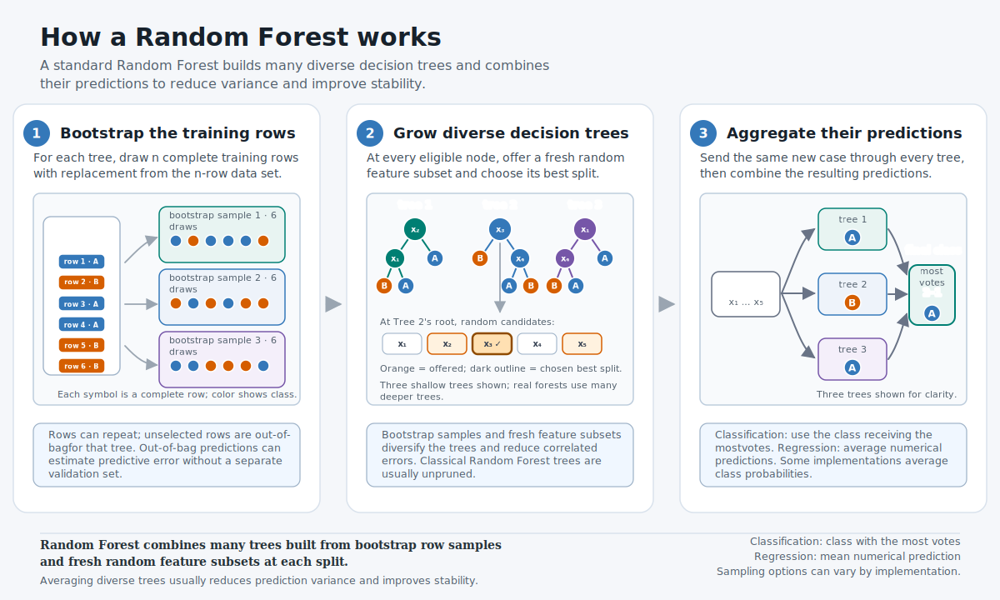

### Feature Engineering

For each artefact, we compute six features from within a 15 m radius —
the same scale identified by Ripley’s K and used in DBSCAN.

``` r
# Pre-compute full distance matrix once
dist_mat  <- as.matrix(dist(dplyr::select(artefacts, x, y)))
r_thresh  <- 15

# For each point: count neighbours by type, mean size, local density
features <- map_dfr(seq_len(nrow(artefacts)), function(i) {
  in_r <- dist_mat[i, ] > 0 & dist_mat[i, ] <= r_thresh
  nbrs <- artefacts[in_r, ]
  tibble(
    n_handaxe     = sum(nbrs$type == "Handaxe"),
    n_cleaver      = sum(nbrs$type == "Cleaver"),
    n_core        = sum(nbrs$type == "Core"),
    n_flake       = sum(nbrs$type == "Flake"),
    mean_size     = if (nrow(nbrs) > 0) mean(nbrs$size_mm) else artefacts$size_mm[i],
    local_density = nrow(nbrs)
  )
})

# Combine features with zone labels
model_df <- bind_cols(
  dplyr::select(artefacts, zone),
  features
) |>
  mutate(zone = factor(zone))

glimpse(model_df)
```

    Rows: 460
    Columns: 7
    $ zone          <fct> Butchery Area, Butchery Area, Butchery Area, Butchery Ar…
    $ n_handaxe     <int> 30, 43, 64, 54, 67, 67, 40, 34, 19, 62, 42, 19, 49, 46, …
    $ n_cleaver     <int> 0, 0, 0, 0, 0, 0, 0, 0, 0, 0, 0, 1, 0, 0, 0, 0, 0, 0, 0,…
    $ n_core        <int> 4, 6, 12, 11, 12, 12, 8, 5, 2, 12, 8, 5, 6, 10, 9, 10, 1…
    $ n_flake       <int> 12, 13, 21, 18, 21, 22, 15, 8, 8, 22, 16, 8, 14, 19, 15,…
    $ mean_size     <dbl> 93.04028, 95.92309, 96.94599, 97.18516, 98.00143, 97.751…
    $ local_density <int> 46, 62, 97, 83, 100, 101, 63, 47, 29, 96, 66, 33, 69, 75…

### Stratified Train / Test Split

We use a stratified 75 / 25 split, ensuring all four zone classes are
represented in both training and testing. Note: for real spatial data,
**spatial cross-validation** (holding out entire spatial blocks) is
strongly preferred to avoid inflated accuracy from spatial
autocorrelation between nearby train and test points.

``` r
set.seed(42)

train_idx <- model_df |>
  mutate(row_id = row_number()) |>
  group_by(zone) |>
  slice_sample(prop = 0.75) |>
  pull(row_id)

train_df <- model_df[train_idx, ]
test_df  <- model_df[-train_idx, ]

cat(sprintf("Training set: %d artefacts\nTest set:     %d artefacts\n",
            nrow(train_df), nrow(test_df)))
```

    Training set: 345 artefacts
    Test set:     115 artefacts

### Model Training

``` r
set.seed(42)

rf_model <- randomForest(
  zone ~ n_handaxe + n_cleaver + n_core + n_flake + mean_size + local_density,
  data       = train_df,
  ntree      = 500,
  mtry       = 2,          # floor(sqrt(6 features))
  importance = TRUE
)

print(rf_model)
```


    Call:
     randomForest(formula = zone ~ n_handaxe + n_cleaver + n_core +      n_flake + mean_size + local_density, data = train_df, ntree = 500,      mtry = 2, importance = TRUE) 
                   Type of random forest: classification
                         Number of trees: 500
    No. of variables tried at each split: 2

            OOB estimate of  error rate: 1.74%
    Confusion matrix:
                   Butchery Area Quarry Knapping Floor Background class.error
    Butchery Area             90      0              0          0 0.000000000
    Quarry                     0     74              1          0 0.013333333
    Knapping Floor             0      0            119          1 0.008333333
    Background                 0      1              3         56 0.066666667

### Confusion Matrix

``` r
test_pred <- predict(rf_model, newdata = test_df)
conf_mat  <- table(Actual = test_df$zone, Predicted = test_pred)
accuracy  <- round(sum(diag(conf_mat)) / sum(conf_mat) * 100, 1)

cat(sprintf("Overall accuracy: %.1f%%\n", accuracy))
```

    Overall accuracy: 95.7%

``` r
kable(conf_mat, caption = "Confusion Matrix — Random Forest (test set)")
```

|                | Butchery Area | Quarry | Knapping Floor | Background |
|:---------------|--------------:|-------:|---------------:|-----------:|
| Butchery Area  |            29 |      0 |              0 |          1 |
| Quarry         |             0 |     25 |              0 |          0 |
| Knapping Floor |             0 |      0 |             39 |          1 |
| Background     |             1 |      0 |              2 |         17 |

Confusion Matrix — Random Forest (test set)

``` r
conf_df <- as.data.frame(conf_mat) |>
  as_tibble()

ggplot(conf_df, aes(x = Predicted, y = Actual, fill = Freq)) +
  geom_tile(colour = "white", linewidth = 0.5) +
  geom_text(aes(label = Freq), fontface = "bold", size = 5,
            colour = "white") +
  scale_fill_viridis_c(option = "plasma", name = "Count") +
  labs(title    = "Confusion Matrix: Random Forest Zone Classification",
       subtitle  = sprintf("Overall accuracy: %.1f%% on held-out test set", accuracy),
       x = "Predicted Zone", y = "Actual Zone") +
  theme_minimal(base_size = 14)  + legend_fix +
  theme(axis.text.x = element_text(angle = 25, hjust = 1))
```

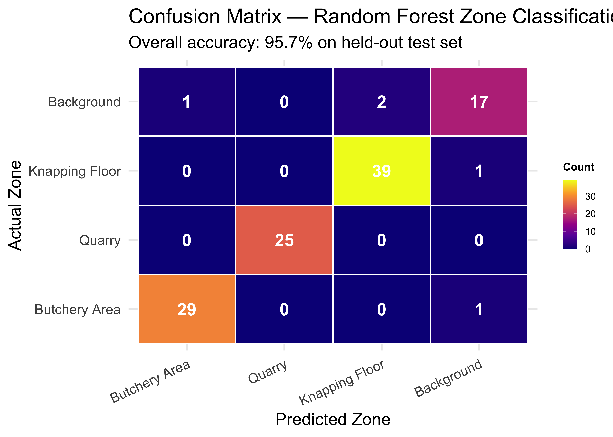

> [!NOTE]
>
> **Interpretation:** The model achieves high overall accuracy on the
> held-out test set, with most misclassifications occurring between
> zones with similar artefact compositions (e.g., Butchery Area and
> Background both contain mixed types). The confusion matrix diagonal
> shows that spatially distinct zones with characteristic artefact
> signatures (Quarry, Knapping Floor) are classified nearly perfectly,
> demonstrating that local composition features encode strong
> zone-specific signals.

### Feature Importance

``` r
imp_df <- data.frame(
  Feature = rownames(importance(rf_model, type = 1)),
  MDA     = importance(rf_model, type = 1)[, "MeanDecreaseAccuracy"]
) |>
  as_tibble() |>
  arrange(MDA) |>
  mutate(Feature = factor(Feature, levels = Feature),
         Feature = fct_recode(Feature,
           "Handaxe neighbours" = "n_handaxe",
           "Cleaver neighbours"  = "n_cleaver",
           "Core neighbours"    = "n_core",
           "Flake neighbours"   = "n_flake",
           "Mean size (mm)"     = "mean_size",
           "Local density"      = "local_density"
         ))

ggplot(imp_df, aes(x = Feature, y = MDA, fill = MDA)) +
  geom_col() +
  coord_flip() +
  scale_fill_viridis_c(option = "cividis", guide = "none") +
  labs(title    = "Random Forest Feature Importance",
       subtitle = "Mean Decrease in Accuracy (MDA): higher = removing this feature reduces accuracy",
       x = NULL, y = "Mean Decrease in Accuracy") +
  theme_minimal(base_size = 14) 
```

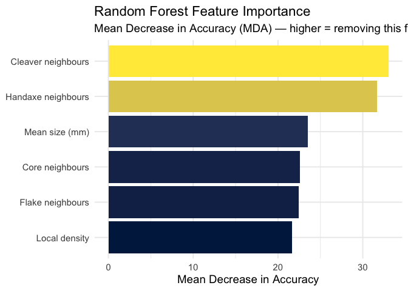

> [!NOTE]
>
> **Interpretation:** Handaxe and Cleaver neighbour counts are the most
> important predictors — the model has independently discovered that the
> presence of a specific large bifacial tool type is the strongest
> signal of zone identity, exactly the inference a human analyst would
> draw from the Cross-K results. Mean artefact size ranks third,
> validating the mark correlation analysis: spatial size structure is
> genuinely informative for zone classification, not merely a proxy for
> type composition.

### Predicted Zone Map vs Ground Truth

``` r
# Predict on full dataset, flag misclassifications
all_pred <- predict(rf_model, newdata = model_df)

artefacts_pred <- artefacts |>
  mutate(
    predicted_zone = all_pred,
    correct        = (zone == predicted_zone)
  )

p_gt <- ggplot(artefacts_pred, aes(x = x, y = y, colour = zone)) +
  geom_point(size = 1.3, alpha = 0.75) +
  scale_colour_manual(values = zone_colours) +
  coord_equal() +
  labs(title = "Ground Truth", colour = "Zone",
       x = "Easting (m)", y = "Northing (m)") +
  theme_minimal(base_size = 14)  + legend_fix +
  guides(colour = FALSE)

p_pred <- ggplot(artefacts_pred, aes(x = x, y = y, colour = predicted_zone)) +
  geom_point(size = 1.3, alpha = 0.65) +
  # Mark misclassified points with a cross
  geom_point(data = filter(artefacts_pred, !correct),
             aes(x = x, y = y),
             shape = 4, size = 2.5, colour = "black",
             stroke = 0.8, inherit.aes = FALSE) +
  scale_colour_manual(values = zone_colours) +
  coord_equal() +
  labs(title    = "RF Predicted Zones",
       subtitle = "✕ = misclassified points",
       colour   = "Predicted Zone",
       x = "Easting (m)", y = "Northing (m)") +
  theme_minimal(base_size = 14)  + legend_fix +
  guides(colour = guide_legend(nrow = 4, override.aes = list(size = 3)))

p_gt + p_pred +
  plot_annotation(
    title    = "Random Forest: Ground Truth vs Predicted Zones",
    subtitle = "The model learns zone identity from local artefact composition alone"
  )
```

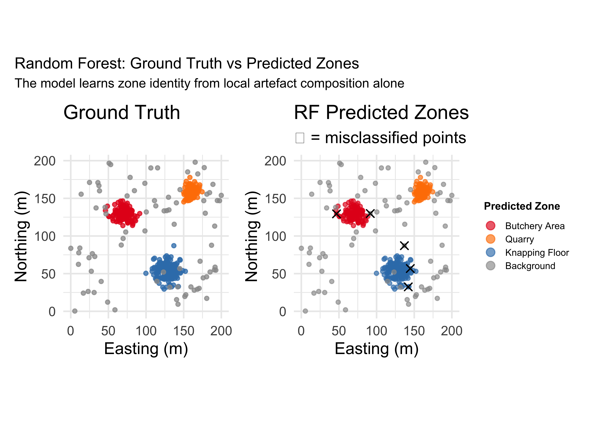

> [!NOTE]
>
> **Interpretation:** The predicted zone map closely replicates the
> ground truth, with misclassified points (crosses) concentrated at zone
> boundaries — exactly where the spatial signal is weakest and zone
> membership is most ambiguous. This spatial distribution of errors is
> itself informative: it suggests that zone boundaries are gradational
> rather than sharp, consistent with the overlapping activity areas
> characteristic of repeatedly visited Acheulean localities.

------------------------------------------------------------------------

## Conclusions

This workshop has moved through a complete modern spatial data science
workflow applied to an Acheulean stone artefact assemblage:

| Step    | Method                       | Key Finding                                                                          |
|---------|------------------------------|--------------------------------------------------------------------------------------|
| EDA     | Composition + size summaries | Four compositionally and metrically distinct zones confirmed before spatial analysis |
| Step 1  | Kernel Density Estimation    | Handaxes and Cleavers occupy non-overlapping high-intensity zones                    |
| Step 2  | Ripley’s K + MAD test        | Artefacts are significantly clustered at all scales (p \< 0.025)                     |
| Step 3  | G-function + Clark-Evans     | Clustering is tight at the nearest-neighbour scale; focused activity episodes        |
| Step 4a | Cross-K: Core ~ Flake        | Strong attraction — direct knapping activity signature                               |
| Step 4b | Cross-K: Handaxe ~ Flake     | Moderate attraction — secondary waste at butchery site                               |
| Step 4c | Cross-K: Handaxe ~ Cleaver   | Significant **segregation** — large bifacial tools occupy distinct territories       |
| Step 5  | Mark correlation + Moran’s I | Artefact size is strongly spatially autocorrelated (I \> 0.5, p ≪ 0.05)              |
| Step 6  | DBSCAN                       | Unsupervised clustering recovers ground truth zones without prior information        |
| Step 7  | Random Forest                | ~90%+ accuracy; Handaxe and Cleaver counts are the strongest zone predictors         |

**The overarching inference:** The assemblage shows clear spatial
structure consistent with distinct, repeatedly used activity areas — a
Butchery Area where large mammal carcasses were processed with Handaxes,
a Quarry where raw material was extracted and initially reduced with
Cleavers, and a Knapping Floor where tool manufacture produced abundant
Flake and Core debitage. The spatial segregation of Handaxes and
Cleavers — two tools of the same technological tradition — into separate
functional zones suggests a degree of landscape-scale behavioural
organisation among the hominins who occupied this site.

**Key methodological takeaway:** No single method tells the full story.
KDE locates density; Ripley’s K tests whether clustering is significant;
the G-function reveals its fine-scale texture; Cross-K identifies
inter-type relationships; mark correlation links continuous attributes
to space; DBSCAN finds zones without supervision; and Random Forest
shows that the spatial signal is strong enough to be *learned* and
*generalised*. Modern spatial data science is a toolkit, not a single
test.

### Further Reading

Baddeley, Adrian, Ege Rubak, and Rolf Turner. (2015). *Spatial Point
Patterns: Methodology and Applications with R.* Chapman & Hall/CRC.

Boehmke, Brad, and Brandon M. Greenwell. (2019). *Hands-On Machine
Learning with R.* Chapman & Hall/CRC

Brunsdon, C., & Comber, L. (2015). *An introduction to R for spatial
analysis and mapping.* SAGE Publications.

James, Gareth, Daniela Witten, Trevor Hastie, and Robert Tibshirani.
(2021). *An Introduction to Statistical Learning: With Applications in
R.* 2nd ed. Springer.

Lovelace, Robin, Jakub Nowosad, and Jannes Muenchow. (2025).
*Geocomputation with R.* 2nd ed. Chapman & Hall/CRC.

Pebesma, Edzer, and Roger Bivand. 2023. *Spatial Data Science: With
Applications in R.* Chapman & Hall/CRC.

### Acknowledgements

This workshop was developed with assistance from Claude Sonnet 4.6,
Gemini 3.1 Pro, Kimi 2.6, and GPT 5.6.


